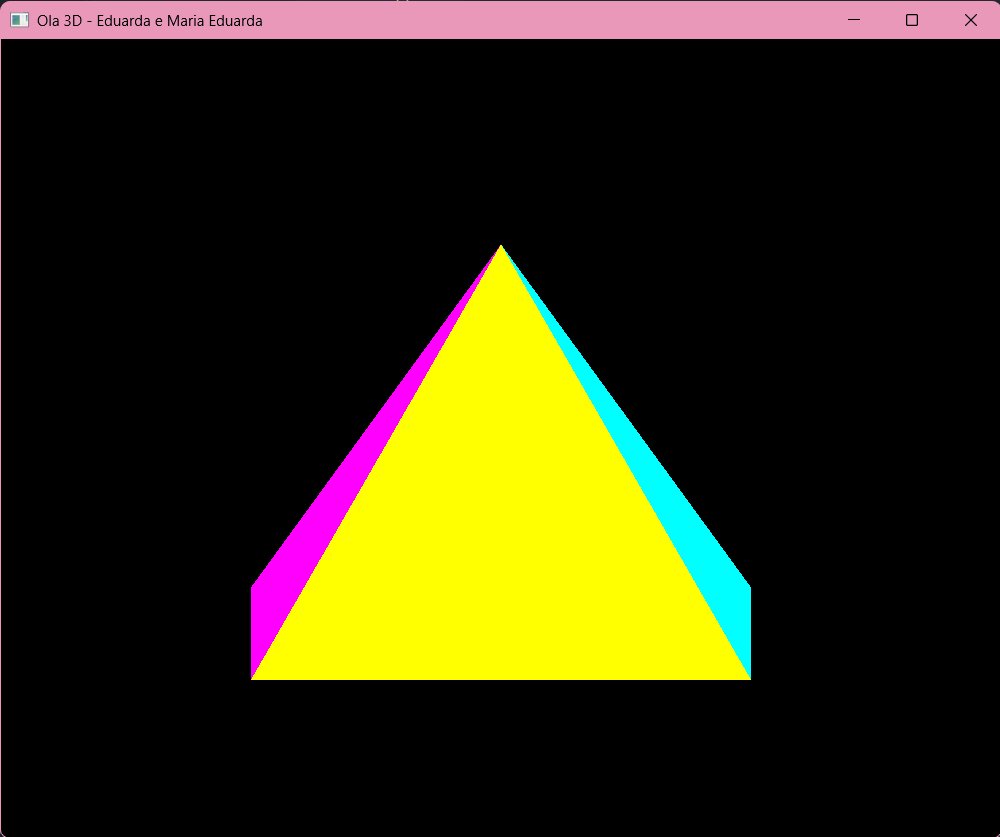

# Resultado - Hello3D

Execução do projeto Hello3D, com o título da janela alterado.

As teclas X, Y e Z rotacionam a pirâmide nos respectivos eixos.
A captura foi feita com a rotação ativa, para mostrar as faces laterais.

Alunas: Eduarda Fernandes e Maria Eduarda Dias
